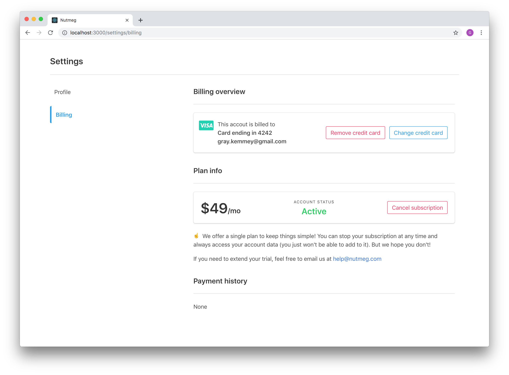

An example Stripe implementation which I wrote more about here: TODO

### Setup

1. `$ bundle exec install`
2. `gem install mailcatcher`
3. `$ cp .env.example .env`
4. Edit that file with your own stripe config and ngrok subdomain
5. `$ bundle exec rails db:create db:migrate`
6. `$ ngrok http -subdomain=whatever_you_put_in_env_file 3000`
7. `$ mailcatcher -f`
8. `$ bundle exec rails server`

### Run the tests

1. `$ bundle exec install`
2. `$ bundle exec rails db:create db:migrate`
3. `$ bundle exec rails test ; bundle exec rails test:system`

### FAQ

#### 1. What about more than one Stripe plan?

You'd have to augment this example. It's only setup to work with having a single plan at the moment, because that's all I needed.

#### 2. Why dot-env over rails credentials?

Idk, I just felt iffy about committing credentials publicly -- even encrypted, test-only ones 🤷‍♂️

#### 3. Why did you call it Nutmeg?

This example is pulled from a project I'm working on called [Skilltree](https://www.skilltree.us), so I just picked a random type of tree 🌳
